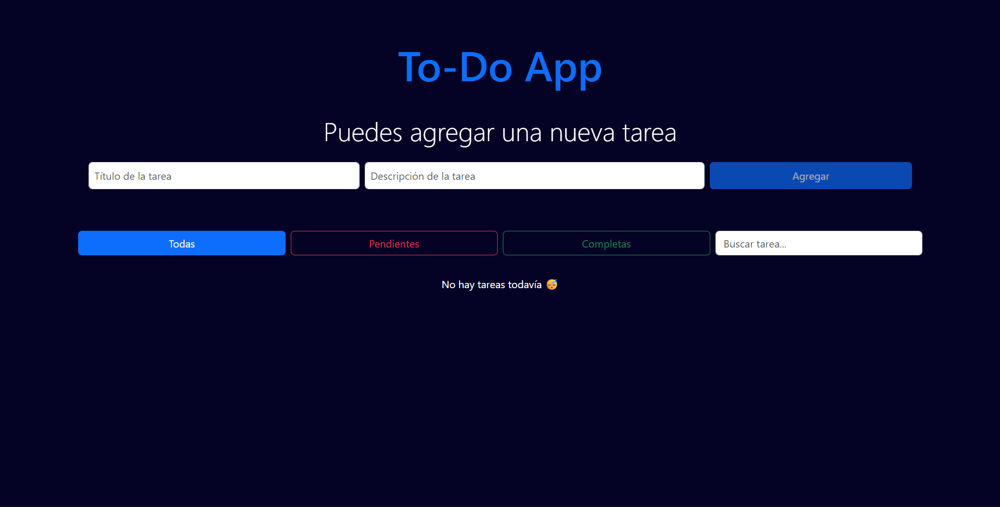
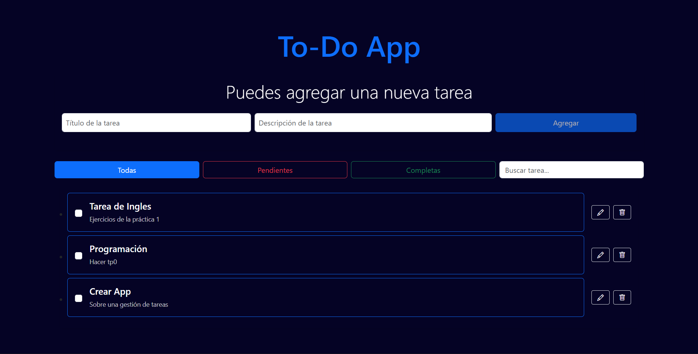
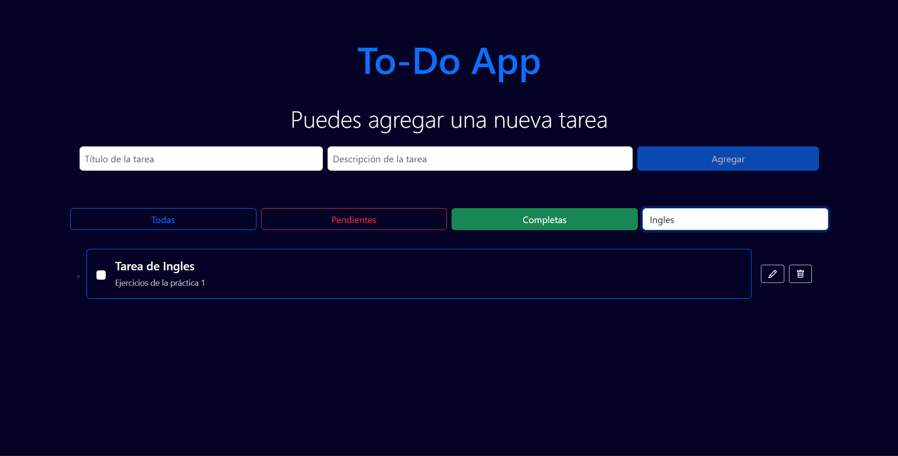
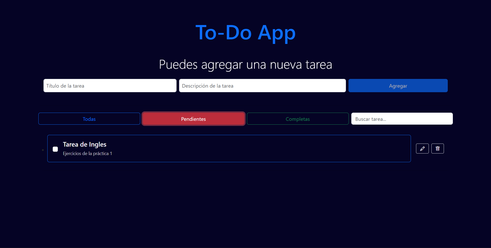
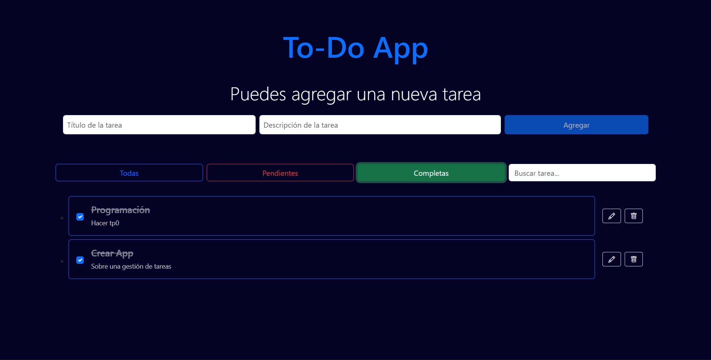
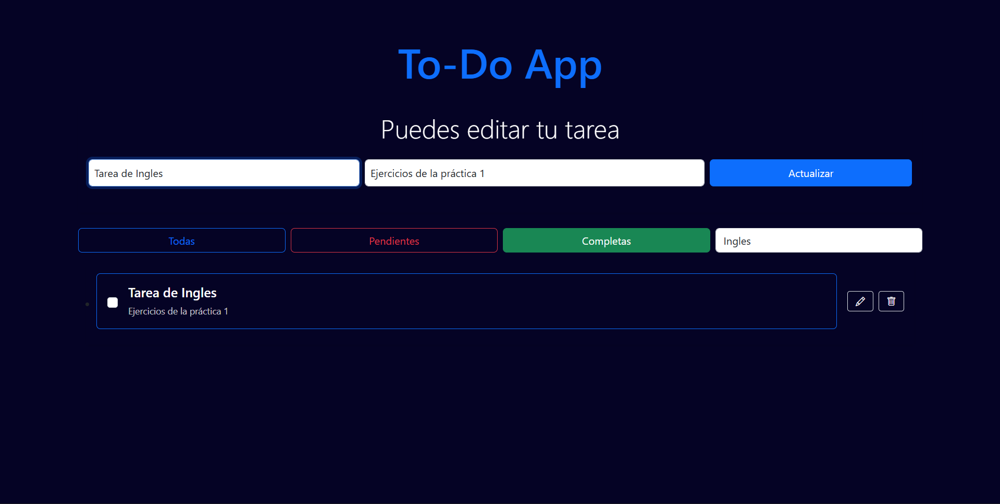

# 📝 TodoApp

Aplicación web de gestión de tareas (To-Do List) que permite a los usuarios crear, visualizar, editar y eliminar tareas de manera sencilla.

La aplicación está desarrollada con React en el frontend y Node.js con Express en el backend, utilizando una API REST para la comunicación entre ambos.

Su objetivo es ayudar a organizar actividades diarias de forma práctica e intuitiva.

---
## 🚀 Funcionalidades

* ✅ Crear nuevas tareas
* 📋 Visualizar lista de tareas
* ✏️ Editar tareas existentes
* 🗑️ Eliminar tareas
* ✔️ Marcar tareas como completadas
* 🔎 Filtrar tareas (todas / pendientes / completadas)
* 🔍 Buscar tareas por título

---
## 🛠️ Tecnologías utilizadas

### 🎨 Frontend

* React
* Vite
* Bootstrap
* JavaScript (ES6+)
* HTML5
* CSS3
* Hooks (useState, useEffect)

### ⚙️ Backend

* Node.js
* Express
* API REST

### 🗄️ Herramientas

* Git
* GitHub
* Postman

---
## 🏗️ Arquitectura

La aplicación sigue una arquitectura cliente-servidor:

* El frontend desarrollado en React se encarga de la interfaz de usuario.
* El backend desarrollado con Node.js y Express gestiona la lógica de negocio y las tareas.
* La comunicación entre ambos se realiza mediante una API REST, utilizando solicitudes HTTP (GET, POST, PUT, DELETE).

---
## ⚙️ Instalación y ejecución

### 📥 Clonar repositorio

```bash
git clone https://github.com/maylimachi/forit-task-app.git
cd forit-task-app
```

### 🔧 Backend

```bash
cd backend
npm install
node server.js
```

### 🎨 Frontend

```bash
cd frontend
npm install
npm run dev
```

### 🌐 Acceso a la aplicación

Abrir en el navegador:
http://localhost:5173

---
## 📸 Screenshots

### 🏠 Vista principal




### ➕ Tareas creadas



### 🔎 Busqueda de Tarea



### ⏳ Tareas Pendientes



### ✅ Tareas completas




### ✏️ Editar tarea



---
## 📁 Estructura del proyecto

```bash
todoapp/
│── frontend/
│   ├── src/
│   ├── public/
│
│── backend/
│   ├── server.js
│   
│── screenshots/
│
│── README.md
```
---
## 🔌 API Endpoints

La API permite gestionar las tareas mediante las siguientes rutas:

* GET api/tasks → Obtener todas las tareas
* POST api/tasks → Crear una nueva tarea
* PUT api/tasks/:id → Actualizar una tarea existente
* DELETE api/tasks/:id → Eliminar una tarea

---
## 👩‍💻 Autor

Desarrollado por Mayra Limachi

💼 Proyecto Fullstack realizado como parte de un challenge técnico propuesto por ForIT.

🚀 El objetivo del challenge fue demostrar habilidades en desarrollo frontend y backend, implementando una aplicación completa con React, Node.js y Express.
